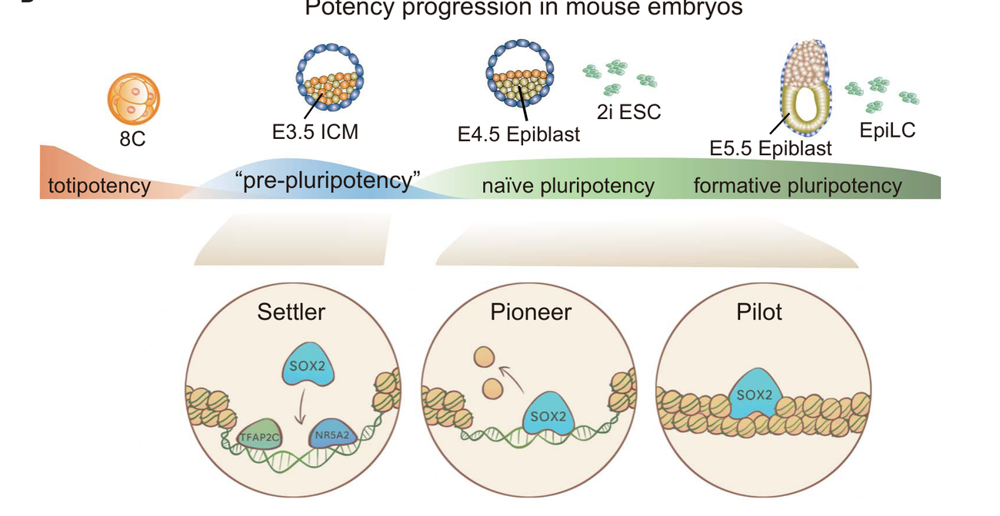
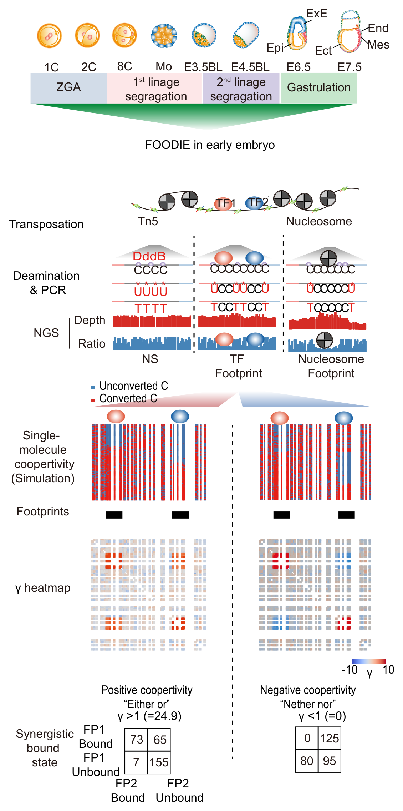

### Hi, I'm Fangnong Lai

Ph.D. from [Wei Xie Lab](http://www.xielab.org.cn/), Tsinghua University. Currently postdoc at [Sunney Xie Lab](https://sunneyxielab.org/sunneyxie) (BIOPIC), Peking University.

#### About my research

My research focuses on how transcription factors and chromatin regulation drive cell fate decisions during early mammalian embryogenesis — from zygotic genome activation through lineage segregation to gastrulation.

During my Ph.D., working with colleagues in the Xie lab, we used low-input epigenomic profiling (CUT&RUN, ATAC-seq, Stacc-seq) and embryo manipulation to dissect the roles of key TFs in preimplantation development. We showed that NR5A2 bridges zygotic genome activation to the first lineage segregation, defined how SOX2 dynamically rewires its chromatin interactions to drive pluripotency progression, and demonstrated that TFAP2C and NR5A2 act as bipotency activators that simultaneously prime both ICM and TE programs in totipotent embryos. We also mapped the stepwise establishment of Polycomb (H2Aub/H3K27me3) regulatory landscapes in human early embryos.

As a postdoc, I am applying single-molecule footprinting (FOODIE) to decode TF combinatorial logic across mouse embryogenesis at near base-pair resolution, including cooperativity quantification between TF pairs, identification of novel regulators on repeat elements, and the global switch from synergistic to competitive TF binding at lineage commitment.

**Keywords:** Zygotic genome activation, totipotency & pluripotency, first lineage segregation, TF cooperativity, Polycomb regulation, cis-regulatory elements, single-molecule footprinting

#### Research interests

##### Overview

Every cell in the body carries the same genome, yet transcription factors (TFs) interpret it differently at every moment of life — to build an embryo, to maintain a tissue, and eventually to let it age. One overarching question drives us: **what role does transcriptional regulation play across the lifespan — from the first divisions of the embryo through the decline of aging — and how do transcription factors act together, in the right order and the right combinations, to control it?** TFs rarely work alone or all at once; the *timing*, *sequence*, and *cooperativity* of their binding — more than any single factor — encode when and where each gene turns on. And they never act on bare DNA: TF binding is in constant cross-talk with the epigenome — DNA methylation, histone modifications, and chromatin accessibility that both gate where factors can bind and are, in turn, reshaped by the factors themselves. How this combinatorial, time-resolved, epigenetically gated logic is written into the genome and read out into cell identity is the thread that runs through our work.

##### In the early embryo

We pursue this question where it is most vivid — the **early mammalian embryo**. In just a few days, a single fertilized cell activates its own genome and resolves into the first distinct lineages: the most concentrated burst of cell-fate decisions in mammalian life, and an ideal system in which to watch transcriptional regulation unfold in real time. Within it, a few connected questions guide us.

**How is one developmental stage handed off to the next?** Development is a relay rather than a string of isolated states, so which factors *connect* transitions rather than merely mark them? We found that the orphan nuclear receptor NR5A2, sharply induced at ZGA, links ZGA to the first lineage segregation: at the 2–8C stage it opens and activates early ICM (*Nanog*, *Pou5f1*, *Tdgf1*), primitive-endoderm (*Gata6*, *Fgfr1/2*) and trophectoderm (*Tead4*, *Gata3*) genes, priming regulatory sites that the NANOG/SOX2/OCT4 network later inherits in the blastocyst. Can a single early factor thus pre-wire the genome for regulators that have not yet appeared?

   
  <b>NR5A2 bridges ZGA and the first lineage segregation.</b> Adapted from Lai <i>et al.</i>, <i>Cell Research</i> 2023 (Fig. 7).

**What decides whether a TF opens chromatin or merely reads it?** Master TFs are routinely cast as universal "pioneers," but does the same factor keep the same job as a cell changes state? We showed that SOX2 acts through three distinct modes as pluripotency matures — *settler* binding at pre-accessible chromatin (E3.5 ICM), *pioneer* binding that opens closed enhancers (naïve pluripotency), and *pilot* binding that poises formative enhancers for faster opening later — suggesting that a TF's function is written as much by chromatin context as by the protein itself.

   
  <b>SOX2 uses settler, pioneer, and pilot binding modes across potency progression.</b> Adapted from Li, Lai <i>et al.</i>, <i>Science</i> 2023 (Fig. 7b).

**How does a cell hold several futures open before it commits?** When opposing lineage programs are both active, are the alternative fates suppressed by mutual repression, or actively kept alive? We found that TFAP2C and NR5A2 act as *bipotency activators* — co-binding and simultaneously turning on both ICM and trophectoderm programs in 8C blastomeres — so that totipotent cells sustain both options rather than silencing one.

   
  <b>TFAP2C and NR5A2 act as bipotency activators at the 8-cell stage.</b> Adapted from Li, Lai <i>et al.</i>, <i>Nature Structural & Molecular Biology</i> 2024 (Fig. 7).

**Where do the instructions for the earliest regulation come from?** If the first TFs need binding sites before canonical enhancers are established, what supplies them? We find that transposable elements — especially B1/SINE repeats — provide the platforms that NR5A2 and other early-stage TFs exploit, tying the mobile-element landscape of the embryo to its transcriptional circuitry.

Together these threads converge on the broader question that now drives our current work: **how is the combinatorial logic of TF binding written into the genome, and how is it read out to build an embryo?**

**Can we watch transcription factors act together, one DNA molecule at a time?** We think so — and the full single-molecule story is on its way. **Stay tuned!**

   
  <b>FOODIE resolves combinatorial TF occupancy, cooperativity, and nucleosome positioning at single-molecule, near-base resolution across early embryogenesis.</b> Schematic of the FOODIE approach (Lai <i>et al.</i>, manuscript in preparation for submission).

##### Approaches

To answer these questions, we utilize a broad experimental and computational toolkit: chromatin and transcriptome profiling (**ChIP-seq**, **ATAC-seq**, **RNA-seq**, **CUT&RUN**, **CUT&Tag**); single-molecule and single-cell readouts (**(sc-)FOODIE**, **scRNA-seq**); massively parallel reporter assays (**STARR-seq**); embryo manipulation and mouse genetics (**micro-injection**, **CRISPR** and **base editing**, **knockdown and knockout mouse models**, **dTAG degron cell lines and mice**); imaging (**IF/IHC**); proteomics (**single-cell MS**, **IP-MS**, **pull-down MS**); and sequence-based deep-learning models (e.g., **ChromBPNet**).

#### Selected co-first-author publications

- **Lai F**#, et al., Tang F*, Xie XS*. Single-molecule footprinting decodes the combinatorial TF regulatory landscape of early mammalian embryogenesis. *Manuscript in preparation*.
- **Lai F**#, Li L#, Hu X#, Liu B#, Zhu Z, Liu L, Fan Q, Tian H, Xu K, Lu X, Li Q, Kong F, Wang L, Lin Z, Deng H, Li J, Xie W. [NR5A2 connects zygotic genome activation to the first lineage segregation in totipotent embryos.](https://www.nature.com/articles/s41422-023-00887-z) ***Cell Research***, 2023. — *Editor's Selections: top articles from the past 3 years.*
- Li L#, **Lai F**#, Hu X#, Liu B#, Lu X, Lin Z, Liu L, Xiang Y, Frum T, Halbisen MA, Chen F, Fan Q, Ralston A, Xie W. [Multifaceted SOX2-chromatin interaction underpins pluripotency progression in early embryos.](https://www.science.org/doi/10.1126/science.adi5516) ***Science***, 2023.
- Li L#, **Lai F**#, Liu L, Lu X, Hu X, Liu B, Lin Z, Fan Q, Kong F, Xu Q, Xie W. [Lineage regulators TFAP2C and NR5A2 function as bipotency activators in totipotent embryos.](https://www.nature.com/articles/s41594-023-01199-x) ***Nature Structural & Molecular Biology***, 2024. — Highlighted in News & Views: [The explosive discovery of TNT in early mouse embryos.](https://www.nature.com/articles/s41594-024-01304-8)
- Hu X#, Zhang C#, Liu B#, **Lai F**#, et al. Establishing Polycomb regulatory landscapes in human early development. ***Nature Genetics***, accepted.
- Yuan Y#, Hu M#, **Lai F**#, Zheng Y, Zhang Y, Pang Y, Xu M, Xu Y, Zhao X, Xie XS*. Asymmetric protein abundance among blastomeres of pre-implantation mouse embryos. *Under revision*.

\# equal contribution · \* corresponding author(s)

#### Participating-author publications

- Yu G#, Xu K#, Xia W#, Zhang K#, Xu Q, Li L, Lin Z, Liu L, Liu B, Du Z, Chen X, Fan Q, **Lai F**, Wang W, Wang L, Kong F, Wang C, Dai H, Wang H, Xie W. [Establishment of chromatin architecture interplays with embryo hypertranscription.](https://doi.org/10.1038/s41586-025-09400-5) ***Nature***, 2025.
- Liu B#, He Y#, Wu X#, Lin Z#, Ma J#, Qiu Y, Xiang Y, Kong F, **Lai F**, Pal M, Wang P, Ming J, Zhang B, Wang Q, Wu J, Xia W, Shen W, Na J, Torres-Padilla M-E, Li J, Xie W. [Mapping putative enhancers in mouse oocytes and early embryos reveals TCF3/12 as key folliculogenesis regulators.](https://doi.org/10.1038/s41556-024-01422-x) ***Nature Cell Biology***, 2024.
- Ji S#, Chen F#, Stein P#, Wang J#, Zhou Z#, Wang L#, Zhao Q, Lin Z, Liu B, Xu K, **Lai F**, Xiong Z, Hu X, Kong T, Kong F, Huang B, Wang Q, Xu Q, Fan Q, Liu L, Williams CJ, Schultz RM, Xie W. [OBOX regulates mouse zygotic genome activation and early development.](https://doi.org/10.1038/s41586-023-06428-3) ***Nature***, 2023.
- Zou Z#, Zhang C#, Wang Q#, Hou Z#, Xiong Z, Kong F, Wang Q, Song J, Liu B, Liu B, Wang L, **Lai F**, Fan Q, Tao W, Zhao S, Ma X, Li M, Wu K, Zhao H, Chen Z, Xie W. [Translatome and transcriptome co-profiling reveals a role of TPRXs in human zygotic genome activation.](https://doi.org/10.1126/science.abo7923) ***Science***, 2022.
- Liu B#, Xu Q#, Wang Q#, Feng S#, **Lai F**, Wang P, Zheng F, Xiang Y, Wu J, Nie J, Qiu C, Xia W, Li L, Yu G, Lin Z, Xu K, Xiong Z, Kong F, Liu L, Huang C, Yu Y, Na J, Xie W. [The landscape of RNA Pol II binding reveals a step-wise transition during ZGA.](https://doi.org/10.1038/s41586-020-2847-y) ***Nature***, 2020.

[Google Scholar](https://scholar.google.co.jp/citations?user=sIlXydoAAAAJ) · [ResearchGate](https://www.researchgate.net/profile/Fangnong-Lai)
